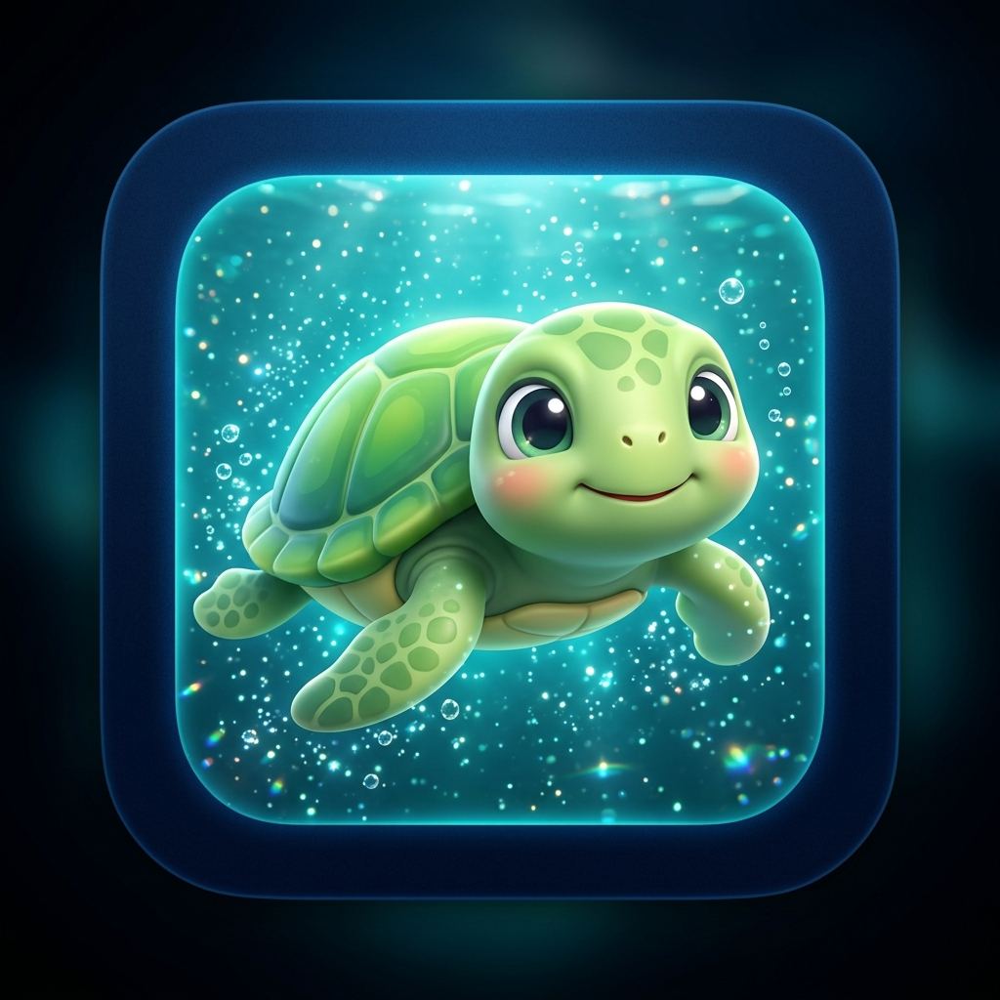

# Tortugotchi — Sea Turtle Protector

<p align="center">
  
</p>

A Tamagotchi-style Progressive Web App that raises awareness of sea turtle conservation. Hatch a nest, raise a juvenile in the open ocean, defend it from real-world hazards (light pollution, plastic, ghost gear, boats, sharks, beachgoers), and keep it healthy long enough to grow from hatchling to adult.

Built as a vanilla HTML / CSS / JS PWA — no build step, installable on iOS and Android, fully playable offline.

## Play

Open [http://localhost:8000/](http://localhost:8000/) after running a static server from the project root:

```bash
python3 -m http.server 8000
```

Then "Add to Home Screen" (iOS) or "Install app" (Chrome/Android) for the full standalone experience.

## Gameplay

Three species — **Green**, **Loggerhead**, **Leatherback** — each with distinct appearance and a preferred playmate. Your turtle ages roughly **one day per 15 seconds** at peak health, slowing as stats decline. Progress persists across sessions via `localStorage`, and offline time is reconciled when you return.

| Stage      | Care loop |
|------------|-----------|
| Nest       | Scare crabs, fill holes, kill artificial lights, walk hatchlings to surf |
| Ocean      | Feed, brush shell, play with species-specific companion, dodge hazards |
| Beaching   | Hold tourists to the NOAA 10-foot boundary while the turtle rests |
| Hazard QTEs | Brace for sharks, dive under boats, cut through ghost nets |

## Tech

- Single-page vanilla JS state machine (`app.js`)
- Inline SVG turtle with CSS-driven species palettes and growth-stage scaling
- Service worker (`sw.js`) with cache-first offline strategy
- Web App Manifest with maskable icons, installable on Chromium, iOS Safari, Firefox Android, Samsung Internet

## Conservation Topics Modeled in the Game

The hazards in Tortugotchi aren't decorative — each one mirrors a documented threat to wild sea turtles:

1. **Light pollution and hatchling disorientation.** Hatchlings orient toward the brightest horizon, which in undisturbed beaches is moonlight on the ocean. Artificial lighting pulls them inland, where they die of exhaustion, dehydration, or predation.
2. **Plastic mimicry.** Floating plastic bags resemble jellyfish, a primary food source for leatherbacks. Ingested plastic causes gut blockage and false satiation; necropsies regularly find plastic in dead turtles of every species.
3. **Ghost gear entanglement.** Lost or abandoned fishing nets and lines drift for years, tangling turtles and preventing them from surfacing to breathe.
4. **Vessel strikes.** Propeller wounds and blunt-force trauma from boats are a leading cause of injury for turtles in coastal waters.
5. **Human disturbance on beaches.** Crowding, touching, and flash photography stress nesting and basking turtles. NOAA and the U.S. Endangered Species Act establish a minimum approach distance of **10 feet (3 meters)** in U.S. waters.
6. **Defensive behavior.** Unlike freshwater turtles, sea turtles **cannot fully retract** into their shells. The in-game "brace" posture reflects how wild turtles actually respond — tucking the head and flippers tight against the carapace.

## Resources & Citations

Used to ground the game's mechanics, species behavior, and conservation messaging.

### Regulatory & Government

- **NOAA Fisheries — Sea Turtles.** Species profiles, threats, recovery plans, and viewing guidelines. <https://www.fisheries.noaa.gov/sea-turtles>
- **NOAA — Sea Turtle Viewing Guidelines.** Establishes the 10-foot / 3-meter minimum approach distance and lighting guidance. <https://www.fisheries.noaa.gov/national/marine-life-distress/sea-turtle-viewing-guidelines>
- **U.S. Fish & Wildlife Service — Sea Turtle Program.** ESA listings, nesting beach management. <https://www.fws.gov/program/sea-turtle>
- **Endangered Species Act of 1973 (16 U.S.C. §§ 1531–1544).** Federal protection framework for all six U.S. sea turtle species. <https://www.fws.gov/law/endangered-species-act>
- **Florida Fish and Wildlife Conservation Commission — Sea Turtle Lighting.** Practical guidance behind the in-game "turn off the lights" mechanic. <https://myfwc.com/conservation/you-conserve/lighting/>

### Scientific & Conservation Organizations

- **IUCN Red List — Marine Turtles.** Current conservation status by species (Green, Loggerhead, Leatherback, Hawksbill, Kemp's ridley, Olive ridley, Flatback). <https://www.iucnredlist.org/>
- **IUCN Marine Turtle Specialist Group (MTSG).** Global assessments, regional management units. <https://www.iucn-mtsg.org/>
- **Sea Turtle Conservancy.** Public education, satellite tracking, nesting beach protection. <https://conserveturtles.org/>
- **SEE Turtles.** Conservation tourism, plastic and lighting campaigns. <https://www.seeturtles.org/>
- **The Ocean Cleanup — Ghost Gear research.** Data on abandoned, lost, and discarded fishing gear (ALDFG). <https://theoceancleanup.com/>
- **Global Ghost Gear Initiative.** Cross-industry effort tracking and removing lost fishing gear. <https://www.ghostgear.org/>

### Selected Research

- Schuyler, Q. A., Wilcox, C., Townsend, K. A., et al. (2016). *Risk analysis reveals global hotspots for marine debris ingestion by sea turtles.* **Global Change Biology** 22(2): 567–576. <https://doi.org/10.1111/gcb.13078>
- Wilcox, C., Puckridge, M., Schuyler, Q. A., Townsend, K., & Hardesty, B. D. (2018). *A quantitative analysis linking sea turtle mortality and plastic debris ingestion.* **Scientific Reports** 8: 12536. <https://doi.org/10.1038/s41598-018-30038-z>
- Witherington, B. E., & Martin, R. E. (2003). *Understanding, Assessing, and Resolving Light-Pollution Problems on Sea Turtle Nesting Beaches.* Florida Marine Research Institute Technical Report TR-2.
- Stelfox, M., Hudgins, J., & Sweet, M. (2016). *A review of ghost gear entanglement amongst marine mammals, reptiles and elasmobranchs.* **Marine Pollution Bulletin** 111(1–2): 6–17. <https://doi.org/10.1016/j.marpolbul.2016.06.034>
- Lutcavage, M. E., Plotkin, P., Witherington, B., & Lutz, P. L. (1997). *Human Impacts on Sea Turtle Survival.* In Lutz & Musick (eds.), *The Biology of Sea Turtles, Vol. I*, CRC Press.

### Species Biology References

- Spotila, J. R. (2004). *Sea Turtles: A Complete Guide to Their Biology, Behavior, and Conservation.* Johns Hopkins University Press.
- Bjorndal, K. A., & Bolten, A. B. (eds., 2003). *Loggerhead Sea Turtles.* Smithsonian Institution Press.
- **NOAA Species Pages** for in-game species:
  - Green Sea Turtle (*Chelonia mydas*): <https://www.fisheries.noaa.gov/species/green-turtle>
  - Loggerhead Sea Turtle (*Caretta caretta*): <https://www.fisheries.noaa.gov/species/loggerhead-turtle>
  - Leatherback Sea Turtle (*Dermochelys coriacea*): <https://www.fisheries.noaa.gov/species/leatherback-turtle>

## How You Can Help (Real World)

- Turn off or shield beachfront lighting during nesting season (roughly May–October in the U.S. Atlantic and Gulf).
- Fill in holes and remove beach furniture before sunset — hatchlings get stuck.
- Pack out all trash; cut six-pack rings and discarded line.
- Keep 10 feet (3 m) from any wild sea turtle. Never use flash.
- Report stranded, injured, or harassed turtles to your regional **NOAA Stranding Network** hotline.

## License

Tortugotchi is a non-commercial educational project. Cited materials remain the property of their respective authors and organizations.
